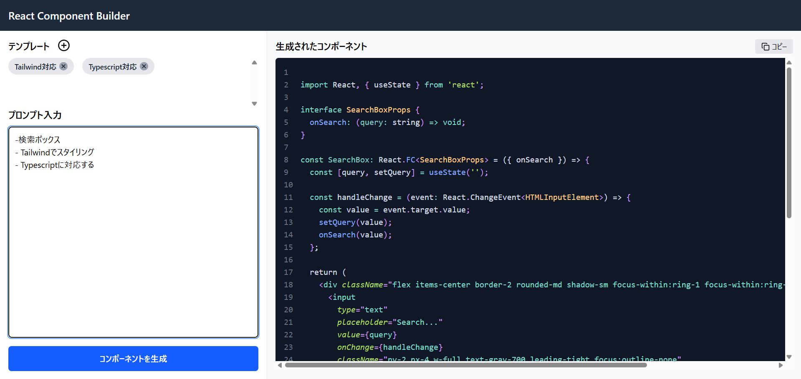
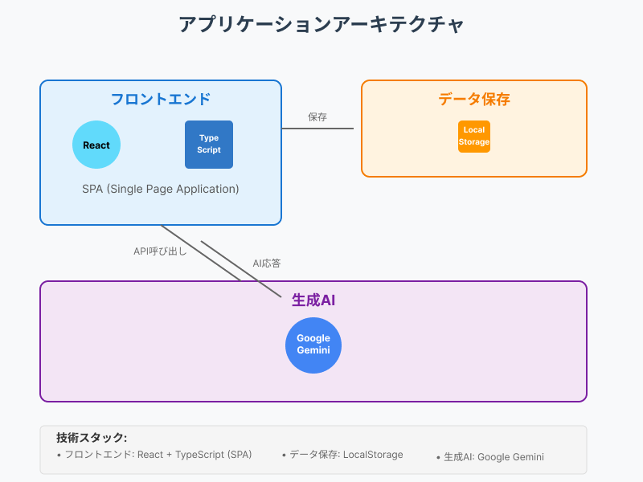

# React Component Builder
「React Component Builder」は生成AIを利用した、コーディング支援サービスです。 <br>
ユーザーは簡単なプロンプトを入力することで、Reactコードを生成することができます。<br>
利便性と効率化に重点を置いた仕様となっており、テンプレート機能、コピーボタンなどで必要なコードをすぐに生成、利用することができます。<br>



## 特徴

- **自然言語からコード生成**: 英語や日本語など、自然言語での入力からReactコンポーネントを生成
- **シンプルなインターフェース**: 左側に要望を入力し、右側に生成されたコードを表示
- **テンプレート機能**:何度も使いまわすプロンプト文はテンプレートとして保存し、効率的に入力することができます。
- **すぐに使えるコード**: 生成されたコードをそのままコピーして既存のプロジェクトに統合可能
- **Gemini AIの活用**: Google の最新生成 AI 技術を統合し、高品質なコードを生成


## インストールと使用方法

1. リポジトリをクローン:


2. 依存関係をインストール:
```bash
npm install
```

3. `.env` ファイルを作成し、Gemini API キーを設定:
```
VITE_GEMINI_API_KEY=your_api_key_here
```

4. アプリケーションを実行:
```bash
npm start
```

### 使い方

1. 左側の入力欄に欲しいReactコンポーネントの説明を入力します
   - 例: "赤い背景と白いテキストを持つ、角丸のボタンコンポーネントを作成してください"
   - 例: "ユーザーの名前と年齢を入力できるフォームコンポーネントを作成してください"

2. 「生成」ボタンをクリックします

3. 右側に表示されたコードをコピーして、あなたのプロジェクトで使用します

## システム構成図



このアプリケーションは、フロントエンドをReact+TypeScriptによるSPAとして構築され、一部データの保存としてLocalStorageを利用しています。
生成AIにはGeminiを利用しています。
- フロントエンド：React+Typescript
- データ保存:LocalStorage
- 生成AI:Gemini

## LocalStorage構成
テンプレート機能の保存として、LocalStorageを利用しています。

保存内容
1. テンプレートID一覧
   - key:"rcc-templateIds"
   - value:保存されているTemplateのID一覧(カンマ区切り文字列)
      - 例:"xxx-xxxx,oooo-oooo,yyyyy-yyy"
      - IDはuuidです

2. 各テンプレート内容
   - key:"rcc-template-<templateID>"(<templateID>には各テンプレートのidが入る)
   - value:templateのjsonデータの文字列
      - 例："{
         id:"xxxx-ooo-yyy",
         label:"hoge",
         description:"hogehoge"
      }"

## プロンプト設計
1.コード生成プロンプト
```
あなたは熟練のフロントエンドエンジニアです。以下の要件に従ってReactコンポーネントを作成してください。

#要件
${request}

#出力形式
- 出力するコードを <CODE> </CODE> で囲んで
- 出力するコードはコードブロックで囲まず、純粋なテキスト形式で出力して

<example>

<CODE>
import ...
const Button = () => {..
</CODE>

<CODE>
import React from "react";

const GeneratedButton = () => {
  return (
    <button className="bg-blue-500 hover:bg-blue-700 text-white font-bold py-2 px-4 rounded">
      Click me
    </button>
  );
};

export default GeneratedButton;
</CODE>

</example>
```

- コードを抽出できるようにタグで囲むように調整
- 出力結果の精度向上のため、何個か例示を追加


## 今後の展望

- コード編集機能の追加
- 生成履歴の保存機能
- コンポーネントのプレビュー機能
- 複数のコンポーネントタイプのテンプレート


